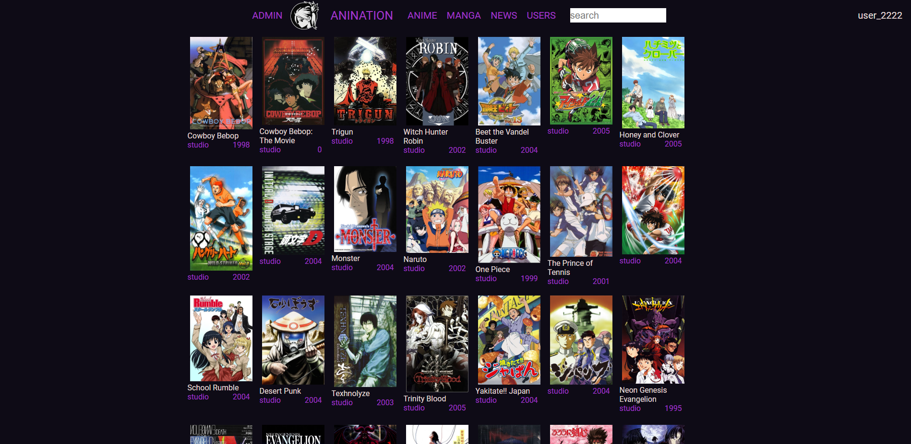
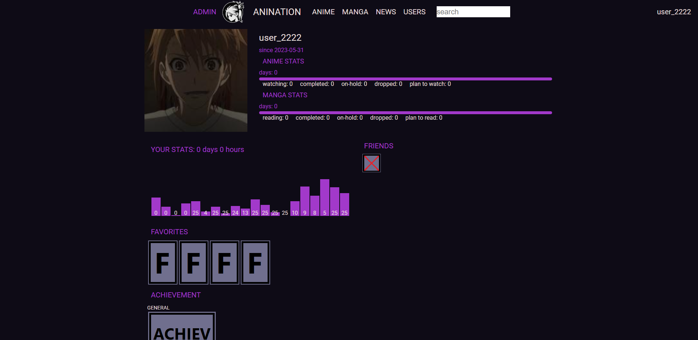
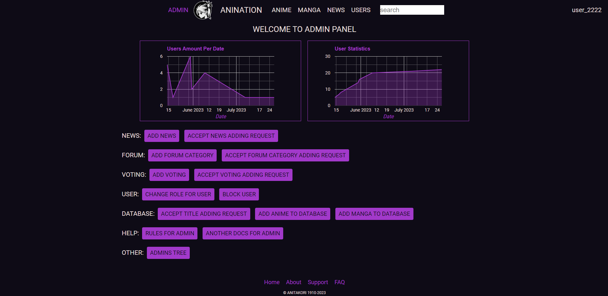
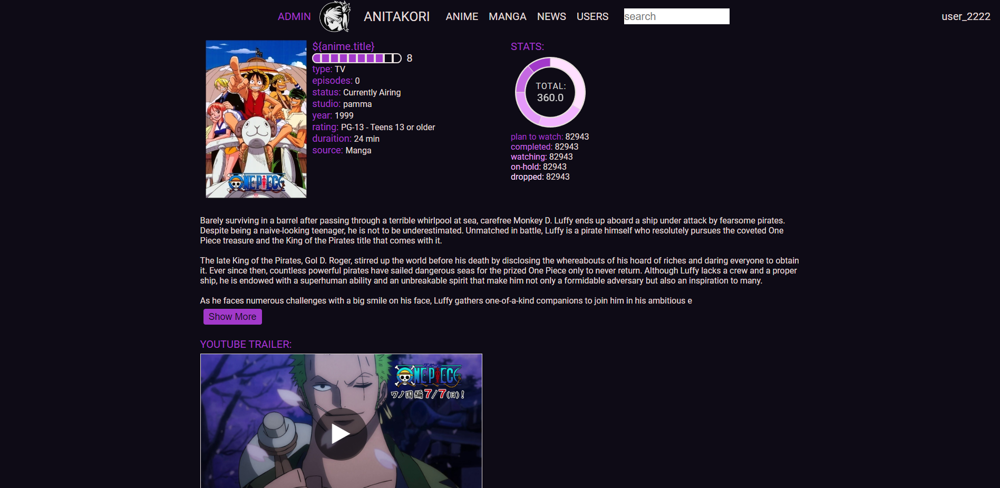

# ANINATION
Website for anime and manga news, where you can storage your list of watching or planned titles and met another people.

### Released features:

* Authentication, authorization.
* Creating, editing user's profile.
* Panel for administration and moderators.
* Creating and editing news post.
* Page with AJAX loading titles from database.

### Technologies used:

* Java, Spring Framework(Boot, Security, Data).
* JS, HTML, CSS.
* AJAX, MAVEN, MySQL.

### Screenshots:
###### Titles, and description

###### User profile

###### Panel for administration and moderation

###### Example of anime title page
